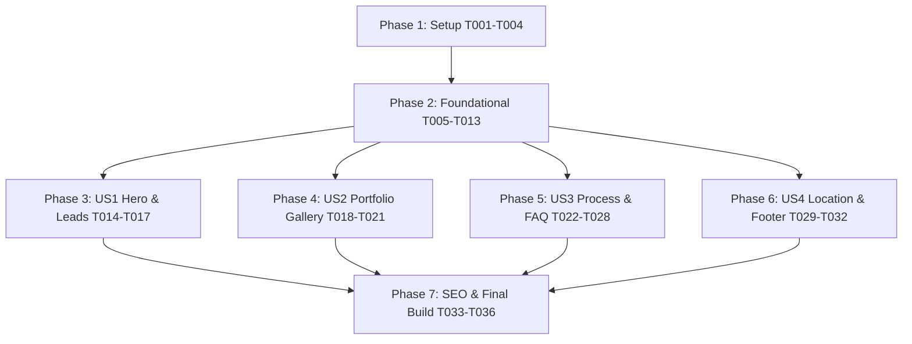

# Tasks: Artzen Ambientes Planejados Landing Page

**Feature**: Artzen Ambientes Planejados Landing Page
**Directory**: `specs/001-landing-page`
**Spec**: [spec.md](spec.md) | **Plan**: [plan.md](plan.md)

---

## Phase 1: Setup (Shared Infrastructure)

**Purpose**: Project initialization, package configuration, TypeScript, Tailwind CSS v4, and directory scaffold.

- [x] T001 Initialize Next.js 16.x App Router project structure with TypeScript and React 19 in `package.json`
- [x] T002 [P] Configure Tailwind CSS v4 theme, design tokens, and fonts in `src/app/globals.css`
- [x] T003 [P] Configure TypeScript paths and compiler options in `tsconfig.json`
- [x] T004 [P] Implement styling utility helper (`cn` with `clsx` and `tailwind-merge`) in `src/lib/utils.ts`

---

## Phase 2: Foundational (Domain Models & Shared Primitives)

**Purpose**: Core data layer, constants, WhatsApp link utility, and shadcn/ui visual primitives required across all sections.

- [x] T005 [P] Create company master information and contact constants in `src/data/company.ts`
- [x] T006 [P] Implement WhatsApp URL and message generator utility in `src/lib/whatsapp.ts`
- [x] T007 [P] Create shadcn/ui Button primitive in `src/components/ui/button.tsx`
- [x] T008 [P] Create shadcn/ui Badge primitive in `src/components/ui/badge.tsx`
- [x] T009 [P] Create shadcn/ui Card primitive in `src/components/ui/card.tsx`
- [x] T010 [P] Create shadcn/ui Accordion primitive in `src/components/ui/accordion.tsx`
- [x] T011 [P] Create shadcn/ui Dialog/Modal primitive in `src/components/ui/dialog.tsx`
- [x] T012 Create persistent Header and Navigation component with mobile responsive drawer in `src/components/layout/Header.tsx`
- [x] T013 Create floating persistent WhatsApp action button with attention pulse in `src/components/layout/FloatingWhatsApp.tsx`

---

## Phase 3: User Story 1 - Discover Services & Request Consultation via WhatsApp (Priority: P1) 🎯 MVP

**Goal**: Deliver a high-impact Hero section, Trust stats bar, and direct WhatsApp consultation actions that turn visitors into qualified sales leads immediately.

**Independent Test**: Load the page on mobile and desktop, inspect the value proposition, and verify that all CTA buttons open WhatsApp (+55 21 99832-4466) with pre-filled greeting messages.

- [x] T014 [US1] Implement Hero section with headline, sub-headline, trust badges, and WhatsApp CTAs in `src/components/sections/HeroSection.tsx`
- [x] T015 [P] [US1] Implement Trust & Key Metrics bar in `src/components/sections/TrustBadgesSection.tsx`
- [x] T016 [P] [US1] Create Quick Briefing / Lead Form component in `src/components/sections/QuickLeadForm.tsx`
- [x] T017 [US1] Assemble MVP landing page view connecting Hero, Trust Bar, and Lead Form in `src/app/page.tsx`

---

## Phase 4: User Story 2 - Explore Interactive Portfolio & Room Categories (Priority: P2)

**Goal**: Deliver an interactive portfolio showcase covering all custom furniture categories (Cozinhas, Dormitórios, Salas, Banheiros, Gourmet, Corporativo) with interactive details modal.

**Independent Test**: Filter environment categories, verify smooth visual transitions, and click on any project card to open the interactive details modal with specifications and custom WhatsApp action.

- [x] T018 [P] [US2] Create environment projects catalog and categories data in `src/data/environments.ts`
- [x] T019 [US2] Implement Project Details Modal component in `src/components/sections/ProjectDetailModal.tsx`
- [x] T020 [US2] Implement Environments & Portfolio gallery with category filter tabs in `src/components/sections/EnvironmentsGallerySection.tsx`
- [x] T021 [US2] Integrate Environments Gallery into `src/app/page.tsx`

---

## Phase 5: User Story 3 - Learn 4-Step Process & Quality Differentials (Priority: P3)

**Goal**: Showcase Artzen's 4-step execution methodology (Briefing -> 3D -> Fabricação -> Montagem), 100% MDF quality differentials, and interactive FAQ accordion.

**Independent Test**: Verify step-by-step visual timeline progression, inspect the materials/MDF guarantee highlights, and interact with the FAQ accordion.

- [x] T022 [P] [US3] Create differentials and process data constants in `src/data/differentials.ts` and `src/data/process.ts`
- [x] T023 [P] [US3] Create FAQ data items in `src/data/faq.ts`
- [x] T024 [P] [US3] Implement Differentials Section in `src/components/sections/DifferentialsSection.tsx`
- [x] T025 [P] [US3] Implement 4-Step Process Timeline Section in `src/components/sections/ProcessTimelineSection.tsx`
- [x] T026 [P] [US3] Implement Materials & Craftsmanship Quality Section in `src/components/sections/MaterialsQualitySection.tsx`
- [x] T027 [US3] Implement Interactive FAQ Section in `src/components/sections/FaqSection.tsx`
- [x] T028 [US3] Integrate Process, Differentials, Materials, and FAQ into `src/app/page.tsx`

---

## Phase 6: User Story 4 - Store Location & Direct Contact Info (Priority: P4)

**Goal**: Showcase physical showroom location in Teresópolis - RJ, opening hours, interactive Google Maps link, Instagram social channel, and global footer.

**Independent Test**: Navigate to the location section, verify physical address (Av. Feliciano Sodré, 396 - Loja 7, Teresópolis - RJ), click Google Maps navigation, and verify footer navigation links.

- [x] T029 [P] [US4] Implement Location & Showroom Contact Section with Google Maps embed/link in `src/components/sections/LocationContactSection.tsx`
- [x] T030 [P] [US4] Implement Final Conversion CTA Banner in `src/components/sections/CtaBannerSection.tsx`
- [x] T031 [P] [US4] Implement Footer with brand summary, links, and local SEO citations in `src/components/layout/Footer.tsx`
- [x] T032 [US4] Integrate Location, CTA Banner, and Footer into `src/app/page.tsx`

---

## Phase 7: Polish, SEO & Performance Standards

**Purpose**: Complete technical SEO, Schema.org JSON-LD LocalBusiness markup, robots.txt, sitemap.xml, Core Web Vitals checks, and final build validation.

- [x] T033 [P] Configure metadata, Open Graph, Twitter Cards, and Schema.org JSON-LD structured data in `src/app/layout.tsx`
- [x] T034 [P] Implement dynamic robots configuration in `src/app/robots.ts`
- [x] T035 [P] Implement automated XML sitemap in `src/app/sitemap.ts`
- [x] T036 Run build validation and TypeScript check via `npm run build` per `specs/001-landing-page/quickstart.md`

---

## Dependencies & Execution Order

---

## Parallel Opportunities

- **Setup**: `T002`, `T003`, `T004` can run in parallel after `T001`.
- **Foundational**: `T005`, `T006`, `T007`, `T008`, `T009`, `T010`, `T011` can run in parallel.
- **US1**: `T015` and `T016` can run in parallel with `T014`.
- **US3**: `T022`, `T023`, `T024`, `T025`, `T026` can run in parallel.
- **US4**: `T029`, `T030`, `T031` can run in parallel.
- **Polish/SEO**: `T033`, `T034`, `T035` can run in parallel.

---

## Implementation Strategy (MVP First)

1. **Phase 1 + 2**: Establish Next.js setup, Clean Minimal Light theme tokens, data structures, and shadcn/ui primitives.
2. **Phase 3 (MVP)**: Build Hero Section, Trust Bar, and Lead Form. Immediate testable value delivering lead conversions to WhatsApp.
3. **Phase 4**: Add Portfolio Gallery with category filters and project modal.
4. **Phase 5**: Add 4-Step Methodology, Differentials (100% MDF), and FAQ.
5. **Phase 6**: Add Showroom location (Teresópolis), CTA Banner, and Footer.
6. **Phase 7**: Add Schema.org LocalBusiness JSON-LD, Open Graph metadata, sitemap.xml, robots.ts, and verify production build.
